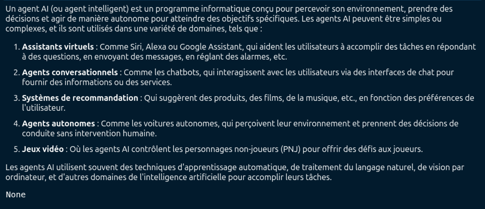
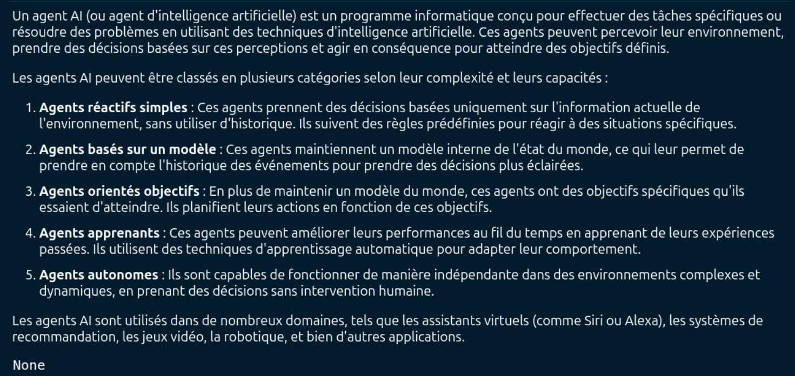
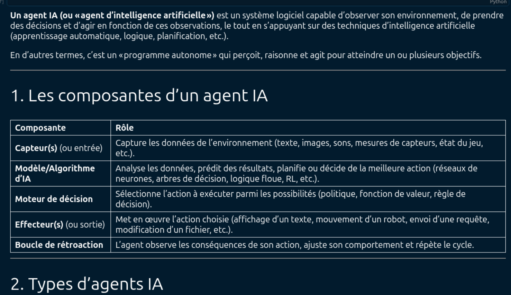
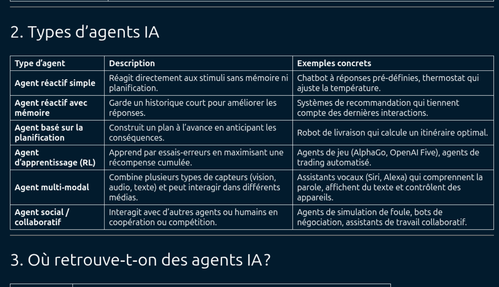
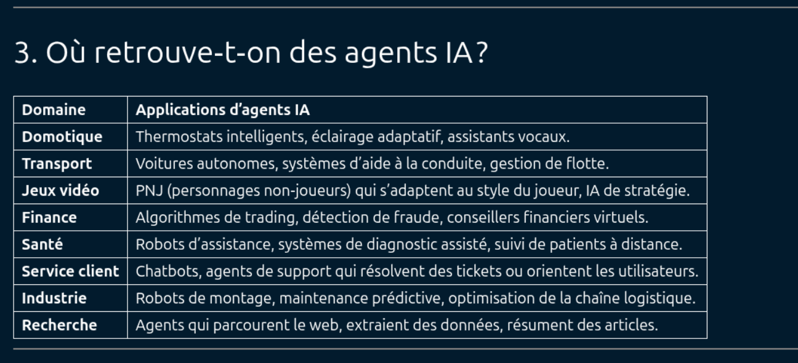
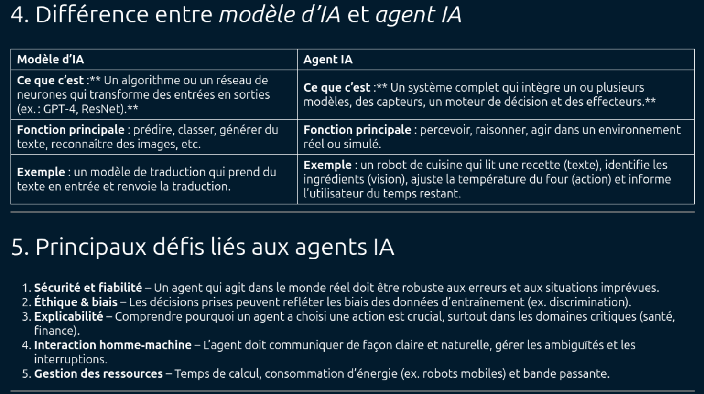
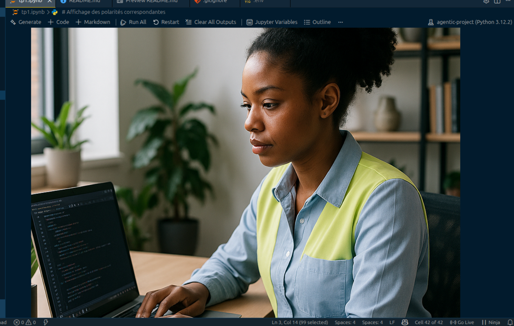

# 🤖 LLM Benchmark Studio

> **Plateforme comparative unifiée pour l'évaluation multi-plateforme de grands modèles de langage avec capacités multimodales et analyse sémantique avancée**

<div align="center">


</div>

---

## 🎯 Vue d'ensemble

**LLM Benchmark Studio** est une architecture modulaire permettant d'interagir de manière uniforme avec trois écosystèmes majeurs de LLMs : **OpenAI (cloud)**, **Ollama (local)** et **Groq (ultra-rapide)**. Le projet implémente le **pattern Bridge** via LangChain pour abstraire les différences d'API et propose une suite complète d'outils d'analyse et de comparaison.

```
┌─────────────┐     ┌──────────────┐     ┌─────────────────┐
│   Prompt    │────▶│  Tokenizer   │────▶│   LLM Bridge    │
│ Utilisateur │     │  (tiktoken)  │     │  (LangChain)    │
└─────────────┘     └──────────────┘     └────────┬────────┘
                                                   │
                    ┌──────────────────────────────┼──────────────────────────────┐
                    ▼                              ▼                              ▼
            ┌───────────────┐              ┌──────────────┐              ┌─────────────┐
            │  OpenAI Cloud │              │ Ollama Local │              │  Groq Ultra │
            │   (GPT-4o)    │              │  (Llama 3.2) │              │  (120B)     │
            └───────┬───────┘              └──────┬───────┘              └──────┬──────┘
                    └──────────────────────────────┼──────────────────────────────┘
                                                   ▼
                                         ┌──────────────────┐
                                         │  Post-processing │
                                         │ • JSON parsing   │
                                         │ • Image decode   │
                                         │ • Visualisation  │
                                         └──────────────────┘
```

---

## ✨ Fonctionnalités principales

<table>
<tr>
<td width="50%">

### 🔤 Tokenisation avancée
- Visualisation segment par segment avec `tiktoken`
- Support tokenizer `o200k_base` pour GPT-4o
- Compteur précis multi-modèles

### 🔄 Benchmark multi-plateforme
- Requêtes parallèles sur 3 écosystèmes LLM
- Comparaison latence / coût / qualité
- Interface LangChain unifiée

</td>
<td width="50%">

### 🖼️ Capacités multimodales
- Vision IA : analyse d'images encodées en base64
- Génération d'images haute qualité via tool binding
- Interface texte/image unifiée

### 📊 Analyse de sentiments aspectuels
- Extraction multi-aspects (screen, keyboard, pad…)
- Classification polarité via prompt engineering
- Sortie structurée JSON prête à l'emploi

</td>
</tr>
</table>

---

## 🧠 Modèles supportés

| Plateforme | Modèle | Avantage clé | Multimodal |
|---|---|---|---|
| ☁️ **OpenAI** | `gpt-4o` | Haute capacité, cloud | ✅ Vision + Génération |
| 🏠 **Ollama** | `llama3.2` | Local, confidentialité totale | ❌ |
| ⚡ **Groq** | `openai/gpt-oss-120b` | Ultra-rapide, open source | ❌ |

---

## 🗂️ Structure du projet

```
📦 agentic-project/
├── 📂 notebooks/
│   └── 📜 tp1.ipynb              # Notebook principal d'exploration
├── 📂 assets/
│   └── 🖼️  img.png               # Image de test pour la vision IA
├── 📜 .env.example               # Template des variables d'environnement
├── 📜 requirements.txt           # Dépendances Python
├── 📜 pyproject.toml             # Configuration du projet
└── 📜 README.md                  # Documentation
```

---

## 🚀 Installation & Lancement

### Prérequis

- Python **3.10+**
- [Ollama](https://ollama.ai/) installé et en cours d'exécution *(pour les modèles locaux)*
- Clés API **OpenAI** et **Groq**

### Étapes d'installation

**1. Cloner le repository**
```bash
git clone https://github.com/Ramadiaw12/agentic_project1
cd agentic-project
```

**2. Créer un environnement virtuel**
```bash
python -m venv .venv
source .venv/bin/activate        # Linux / macOS
.venv\Scripts\activate           # Windows
```

**3. Installer les dépendances**
```bash
pip install -r requirements.txt
```

**4. Configurer les variables d'environnement**
```bash
cp .env.example .env
# Éditer .env et renseigner vos clés API
```

```env
OPENAI_API_KEY=sk-...
GROQ_API_KEY=gsk_...
```

**5. Lancer le notebook**
```bash
jupyter notebook notebooks/tp1.ipynb
```

---

## 📚 Exemples d'utilisation

### 🔤 1. Visualisation de tokenisation

```python
from tokenizer_utils import tokens_count, visualize_tokens

prompt = "Vous êtes un assistant expert dans l'analyse"
print(f"Nombre de tokens: {tokens_count(prompt)}")
visualize_tokens(prompt)
```

```
Nombre de tokens: 8
Vous| êtes| un| assistant| expert| dans| l'|analyse|
```

---

### 🔄 2. Benchmark cross-plateforme

```python
from langchain_openai import ChatOpenAI
from langchain_ollama import ChatOllama
from langchain_groq import ChatGroq

models = {
    "OpenAI GPT-4o":     ChatOpenAI(model="gpt-4o"),
    "Ollama Llama 3.2":  ChatOllama(model="llama3.2"),
    "Groq GPT-OSS-120B": ChatGroq(model="openai/gpt-oss-120b")
}

for name, model in models.items():
    response = model.invoke("Qu'est-ce qu'un agent AI ?")
    print(f"\n=== {name} ===\n{response.content[:200]}...")
```

---

### 🖼️ 3. Analyse d'image par vision IA

```python
from multimodal_handler import analyze_image, generate_image

# Analyser une image existante
description = analyze_image("assets/screenshot.png")
print(f"L'IA voit : {description}")

# Générer une image par IA
generated_img = generate_image("Femme ingénieure informatique dans son bureau")
display(generated_img)
```

---

### 📊 4. Analyse de sentiments aspectuels

```python
from sentiment_analyzer import analyze_aspect_sentiment

review = "J'ai beaucoup aimé l'écran! La souris n'est pas bonne et le clavier ma fih tchah"
result = analyze_aspect_sentiment(review)

print(f"Catégories : {result['category']}")
print(f"Polarités  : {result['polarity']}")
```

```json
{
  "category": ["screen", "keyboard", "pad"],
  "polarity": ["positive", "negative", "neutral"]
}
```

---

## 🏗️ Architecture & Design Patterns

```
Pattern         Rôle dans le projet
─────────────────────────────────────────────────────────────────
Bridge          LangChain abstrait les différences entre les APIs
Strategy        Tokenisation adaptative selon le modèle (tiktoken / fallback)
Factory         Initialisation dynamique du client LLM selon la plateforme
Prompt Eng.     System messages, few-shot prompting, structured output JSON
```

---

## 📈 Résultats expérimentaux

### 🔬 Benchmark : "Qu'est-ce qu'un agent AI ?"

L'expérience clé du projet consiste à soumettre la même question fondamentale aux trois modèles et d'en comparer les réponses en termes de style, profondeur et structure.

---

#### ☁️ GPT-4o — OpenAI



*Figure 1 : Réponse détaillée de GPT-4o — définition et applications des agents intelligents*

**Analyse :**
- ✅ **Structure claire** : Organisation en 5 catégories distinctes d'applications
- ✅ **Exemples concrets** : Siri, Alexa, Google Assistant, voitures autonomes
- ✅ **Exhaustivité** : Couverture des domaines majeurs (assistants, recommandation, jeux vidéo)
- ✅ **Précision technique** : Mention des techniques sous-jacentes (ML, NLP, vision par ordinateur)

---

#### 🏠 Llama 3.2 — Ollama (Local)



*Figure 2 : Réponse de Llama 3.2 — approche taxonomique et classification hiérarchique des agents*

**Analyse :**
- ✅ **Approche taxonomique** : Classification en 5 catégories (réactifs simples → autonomes)
- ✅ **Pédagogie technique** : Explication détaillée des mécanismes internes de chaque type
- ✅ **Profondeur conceptuelle** : Distinction agents réactifs vs agents avec mémoire interne
- ✅ **Couverture complète** : Des agents simples aux agents autonomes complexes

---

#### ⚡ GPT-OSS-120B — Groq



*Figure 3 : Réponse de Groq — vision systémique et architecturale des agents IA*

**Analyse :**
- ✅ **Approche systémique** : Décomposition en composantes fondamentales (capteurs, modèle, moteur de décision, effecteurs, boucle de rétroaction)
- ✅ **Format didactique** : Utilisation de tableaux pour structurer l'information
- ✅ **Exhaustivité technique** : Couverture des mécanismes internes (réseaux de neurones, RL, logique floue)
- ✅ **Vision holistique** : Agent présenté comme un système en boucle fermée

---

#### 📊 Synthèse comparative — Tableau typologique des agents IA (Groq)



*Figure 4 : Matrice comparative des types d'agents IA avec exemples concrets — générée par Groq*

**Points saillants :**
- ✅ **Matrice décisionnelle** : Organisation 3 colonnes (type · description · exemples)
- ✅ **Couverture exhaustive** : 6 catégories, des agents réactifs simples aux agents sociaux collaboratifs
- ✅ **Exemples pertinents** : AlphaGo, thermostat, assistants vocaux…
- ✅ **Hiérarchie progressive** : Du plus simple (réactif) au plus complexe (social/collaboratif)

---

#### 🌐 Panorama applicatif — Domaines d'utilisation des agents IA



*Figure 5 : Vue d'ensemble des secteurs d'activité exploitant des agents intelligents*

| Domaine | Enjeux clés | Impact |
|---|---|---|
| 🏠 **Domotique** | Confort, efficacité énergétique | Automatisation du quotidien |
| 🚗 **Transport** | Sécurité, optimisation des flux | Mobilité autonome |
| 🎮 **Jeux vidéo** | Immersion, adaptabilité | Expérience utilisateur enrichie |
| 💹 **Finance** | Réactivité, détection d'anomalies | Transactions optimisées |
| 🏥 **Santé** | Diagnostic, assistance médicale | Soins personnalisés |
| 🎧 **Service client** | Disponibilité 24/7, résolution rapide | Expérience client améliorée |
| 🏭 **Industrie** | Productivité, maintenance prédictive | Industrie 4.0 |
| 🔬 **Recherche** | Analyse de données, automatisation | Accélération scientifique |

---

#### 🧠 Clarification conceptuelle — Modèle d'IA vs Agent IA



*Figure 6 : Comparaison conceptuelle entre un modèle d'IA (algorithme) et un agent IA (système complet)*

| Défi | Enjeu |
|---|---|
| **Sécurité & fiabilité** | Robustesse face aux situations imprévues |
| **Éthique & biais** | Éviter la discrimination issue des données d'entraînement |
| **Explicabilité** | Comprendre et justifier les décisions prises |
| **Interaction homme-machine** | Communication naturelle et gestion des ambiguïtés |
| **Gestion des ressources** | Optimisation du temps de calcul et de l'énergie |

---

#### 💻 Environnement d'exécution — Jupyter Notebook



*Figure 7 : Environnement de développement interactif avec visualisation des résultats d'analyse de sentiments*

**Fonctionnalités de l'environnement :**
- ✅ **Exécution cellulaire** : Exécution pas à pas du code
- ✅ **Affichage Markdown intégré** : Visualisation directe des réponses formatées
- ✅ **Gestion des variables** : Suivi en temps réel des objets en mémoire
- ✅ **Outputs persistants** : Conservation des résultats d'exécution

---

### Benchmark de latence & capacités

| Critère | GPT-4o (OpenAI) | Llama 3.2 (Ollama) | GPT-OSS (Groq) |
|---|---|---|---|
| ⏱️ Latence | ~2s | ~3s *(dépend hardware)* | **~0.5s** |
| 💰 Coût | Payant | **Gratuit** (local) | Payant (volume) |
| 🔒 Confidentialité | Données cloud | **Données locales** | Données cloud |
| 🖼️ Multimodal | **✅ Vision + Génération** | ❌ | ❌ |
| 🔤 Tokenizer | tiktoken | Propriétaire | Propriétaire |

### Synthèse qualitative des réponses

| Modèle | Style de réponse | Point fort |
|---|---|---|
| **GPT-4o** | Listes structurées, exemples concrets | Accessibilité grand public |
| **Llama 3.2** | Hiérarchie taxonomique rigoureuse | Profondeur technique |
| **GPT-OSS (Groq)** | Tableaux comparatifs, vision systémique | Synthèse architecturale |

### Guide de sélection du modèle

```
🎯 Diffusion grand public       →  GPT-4o (OpenAI)
📚 Formation technique          →  Llama 3.2 (Ollama)
🏗️ Architecture & systèmes      →  GPT-OSS-120B (Groq)
🔒 Confidentialité totale       →  Llama 3.2 (Ollama, 100% local)
⚡ Prototypage rapide           →  Groq (latence < 0.5s)
```

---

## 🧩 Dépendances principales

```python
# requirements.txt
langchain>=0.1.0
langchain-openai>=0.1.0
langchain-groq>=0.1.0
langchain-ollama>=0.1.0
tiktoken>=0.5.0
python-dotenv>=1.0.0
jupyter>=1.0.0
ipython>=8.0.0
pillow>=10.0.0
```

---

## 🔐 Sécurité & bonnes pratiques

- 🔑 Clés API stockées dans `.env` *(ignoré par `.gitignore`)*
- ✅ Validation des entrées avant envoi aux modèles
- 🛡️ Gestion des erreurs avec `try/except` pour résilience
- 📉 Rate limiting implicite via la gestion des tokens

---

## 🚧 Axes d'amélioration envisagés

- [ ] **Cache intelligent** — Réduire coûts et latence sur les requêtes fréquentes
- [ ] **Benchmark automatisé** — Métriques BLEU / ROUGE pour évaluation objective
- [ ] **Interface Streamlit** — Remplacer Jupyter par une app web interactive
- [ ] **Fine-tuning** — Adapter un modèle local à un domaine métier spécifique
- [ ] **Multimodal étendu** — Analyse vidéo et audio
- [ ] **RAG (Retrieval-Augmented Generation)** — Base de données vectorielle pour contexte enrichi
- [ ] **Monitoring temps réel** — Dashboard coûts API et temps de réponse
- [ ] **Pipeline CI/CD** — Tests automatisés des prompts et validation des sorties JSON

---

## 📖 Références

- [LangChain Documentation](https://docs.langchain.com/)
- [OpenAI API Reference](https://platform.openai.com/docs)
- [Groq Documentation](https://console.groq.com/docs)
- [Ollama Models](https://ollama.ai/library)
- [tiktoken — OpenAI Tokenizer](https://github.com/openai/tiktoken)

---

<div align="center">

**👩‍💻 Auteure : DIAWANE Ramatoulaye**  
**📅 Mars 2026 · 🎓 Projet Benchmark & Analyse de Modèles de Langage**

*Ce projet démontre une maîtrise de base des LLMs, de l'ingénierie des prompts et de l'intégration multi-plateforme, avec une approche pragmatique et orientée résultats.*

</div>